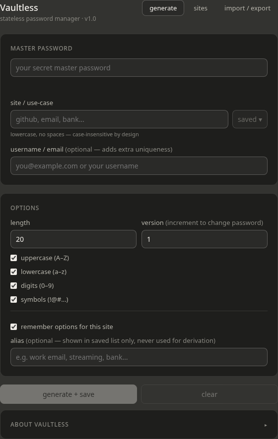

# Vaultless

> **Disclaimer:** Unlike my other projects, this one was built mostly by AI. The code was produced iteratively through conversation with [Claude](https://claude.ai) (Anthropic) via [Claude Code](https://claude.ai/code). I contributed code review, security critique, and minor corrections throughout.

A stateless, single-file password manager. No vault, no server, no installation.

**[Try it live →](https://www.bytekeeper.org/vaultless/)**



Or download `vaultless.html` and open it in any modern browser. Nothing is sent anywhere.

## How it works

Passwords are **derived**, not stored. Every password is computed on-the-fly from:

```
PBKDF2-SHA256( master password, site + username + version, 1,000,000 iterations )
```

The same inputs always produce the same output — so you never need to store the password itself. Lose your device, open the file on another machine, and all your passwords are reproducible from memory alone.

**What *is* optionally stored** (in `localStorage`, encrypted): site names, usernames, aliases, and per-site config (length, character classes, version). Every field is individually AES-GCM-256 encrypted — nothing in storage is plaintext.

## Security primitives

| Primitive | Purpose |
|-----------|---------|
| PBKDF2-SHA256, 1,000,000 iterations | Password derivation |
| HMAC-SHA256 | Site hash (keyed on full master password) |
| AES-GCM-256, 100,000 iterations | Per-entry localStorage encryption |
| AES-GCM-256, 1,500,000 iterations | Export file encryption |

All cryptography uses the browser's built-in [Web Crypto API](https://developer.mozilla.org/en-US/docs/Web/API/Web_Crypto_API) — zero dependencies, zero supply chain risk.

## Export file

The exported `.json` file is safe to store publicly (e.g. in a git repo or cloud drive). It contains **no plaintext whatsoever** — not site names, not usernames, not even metadata like password length or character classes. The only unencrypted fields are the PBKDF2 iteration count and a random KDF salt (both public by design). Each site entry is encrypted individually with AES-GCM-256, so a diff reveals only that a single entry changed — nothing about its contents.

## Design philosophy

**Zero dependencies — minimal supply-chain surface.**
The entire application is a single self-contained HTML file with no npm packages, no CDN links, and no runtime network requests. Every byte that executes in your browser ships directly from this repository. There is nothing in the dependency graph that a compromised package or CDN can inject.

**Browser-native cryptography only.**
All cryptographic operations use the browser's built-in [Web Crypto API](https://developer.mozilla.org/en-US/docs/Web/API/Web_Crypto_API) — the same API underlying TLS and browser key storage. It is independently audited, hardware-accelerated where available, and carries none of the supply-chain risk of a third-party crypto library.

**On the algorithm choices.**
The primitives used are the strongest options available within the Web Crypto API constraints:

- **PBKDF2-SHA256** is the only password-based KDF the Web Crypto API exposes. Argon2id is the modern first choice for password hashing (it is memory-hard, making GPU/ASIC attacks significantly more expensive) but is not available in browsers without pulling in a WASM library — which would reintroduce supply-chain risk. At 1,000,000 iterations, the configuration exceeds OWASP's recommended minimum of 600,000 for PBKDF2-HMAC-SHA256.
- **HMAC-SHA256** is a standard, NIST-approved keyed PRF with no known practical weaknesses.
- **AES-GCM-256** is OWASP's first-preference authenticated encryption mode: it provides both confidentiality and ciphertext integrity. A fresh random 96-bit nonce is generated for every encryption call, satisfying the nonce-uniqueness requirement.

**Stateless derivation over encrypted storage.**
Passwords are never stored — not even in encrypted form. They are derived on demand from inputs you carry in your head. The only persistent state (optional, in `localStorage` or an export file) is per-site metadata: site name, username, alias, password length, character classes, and version counter. Every field is AES-GCM-256 encrypted, so a full storage or export-file leak reveals nothing — not even which services you use or how many characters your passwords have.

## Usage

1. Enter your master password and a site name (`github`, `email`, …)
2. Optionally add a username for extra uniqueness
3. Hit **generate + save**
4. To get a new password for a site (breach, forced rotation): increment the **version** number

Inspired by [LessPass](https://lesspass.com). Vaultless builds on the same stateless derivation idea with a few deliberate improvements:

| | LessPass | Vaultless |
|---|---|---|
| PBKDF2 iterations | 100,000 | 1,000,000 |
| Site names in storage | Plaintext | HMAC-SHA256 keyed on master password — an attacker with your storage cannot enumerate which services you use |
| Stored metadata | Plaintext (server DB) or unencrypted CSV export | AES-GCM-256 encrypted per entry in both localStorage and export file — including config fields like length and character classes |
| Export file | Unencrypted CSV | Encrypted JSON, safe to store publicly |
| Salt construction | Raw string concatenation of `site + login + counter` | Domain-separated: `vaultless:site:username:version` — eliminates ambiguous splits |
| Server component | Optional sync database (decommissioned Nov 2024) | None — no server, no account |

**A quick note though:** LessPass is battle-tested — but *this* project is not and should be used with care.
